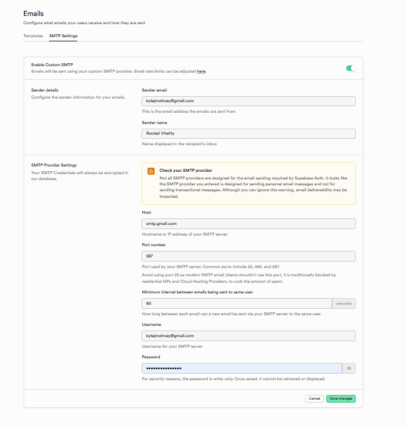

# Supabase Configuration - Rooted Vitality

## Credentials
- **URL:** `https://racsktdyrvepyvndbjzs.supabase.co`
- **Anon Key:** Stored in `/scripts/config.js`
- **Project ID:** `racsktdyrvepyvndbjzs`

## Database Schema

### profiles table
```sql
CREATE TABLE public.profiles (
  id UUID PRIMARY KEY REFERENCES auth.users(id) ON DELETE CASCADE,
  email TEXT NOT NULL UNIQUE,
  role TEXT DEFAULT 'client' CHECK (role IN ('client', 'practitioner')),
  first_name TEXT,
  last_name TEXT,
  phone TEXT,
  age INTEGER,
  sex TEXT,
  gender TEXT,
  created_at TIMESTAMP WITH TIME ZONE DEFAULT NOW(),
  updated_at TIMESTAMP WITH TIME ZONE DEFAULT NOW()
);

CREATE INDEX idx_profiles_email ON public.profiles(email);
CREATE INDEX idx_profiles_role ON public.profiles(role);
ALTER TABLE public.profiles ENABLE ROW LEVEL SECURITY;
```

### RLS Policies
```sql
CREATE POLICY "enable insert for auth users" ON public.profiles
  FOR INSERT WITH CHECK (auth.uid() = id);

CREATE POLICY "enable select for auth users" ON public.profiles
  FOR SELECT USING (auth.uid() = id);

CREATE POLICY "enable update for auth users" ON public.profiles
  FOR UPDATE USING (auth.uid() = id);

CREATE POLICY "Service role bypass" ON public.profiles
  FOR ALL TO service_role USING (true) WITH CHECK (true);
```

## Email Configuration (SendGrid)

**SendGrid API Key:** `[REDACTED - Use environment variable]`

**Supabase SMTP Settings:**
- Host: `smtp.sendgrid.net`
- Port: `587`
- Username: `apikey`
- Password: `[REDACTED - Use environment variable]`
- Sender Email: `kylejmohney@gmail.com`
- Sender Name: `Rooted Vitality`

## Setup Steps
1. Create Supabase project
2. Run schema SQL above
3. Add credentials to `/scripts/config.js`
4. Enable email auth in Supabase dashboard
5. Configure SendGrid SMTP in Authentication → Email → SMTP Settings
5. Configure SMTP (optional, for production)

## Email Settings
- **Free tier:** 3-4 emails/hour limit
- **Solution:** Custom SMTP (Gmail) or disable confirmations for testing
- **SMTP:** smtp.gmail.com:587 with app password

## Status
✅ Connected and operational
